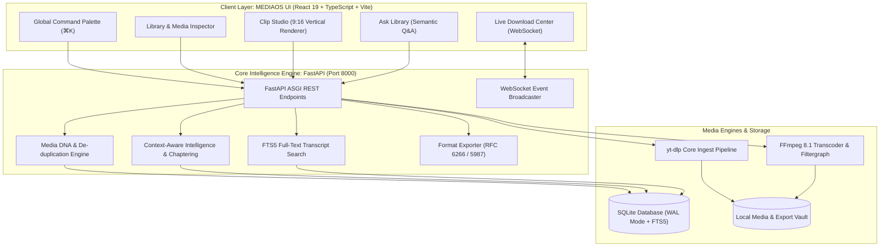

<div align="center">

```
  ███╗   ███╗███████╗██████╗ ██╗ █████╗  ██████╗ ███████╗
  ████╗ ████║██╔════╝██╔══██╗██║██╔══██╗██╔═══██╗██╔════╝
  ██╔████╔██║█████╗  ██║  ██║██║███████║██║   ██║███████╗
  ██║╚██╔╝██║██╔══╝  ██║  ██║██║██╔══██║██║   ██║╚════██║
  ██║ ╚═╝ ██║███████╗██████╔╝██║██║  ██║╚██████╔╝███████║
  ╚═╝     ╚═╝╚══════╝╚═════╝ ╚═╝╚═╝  ╚═╝ ╚═════╝ ╚══════╝
```

### The Autonomous AI Media Intelligence, Transcoding & Semantic Operating System
*Supercharging the world's most powerful media engine with Neural Understanding, Media DNA & Real-Time Studio Tools.*

<p align="center">
  <a href="#quick-start"></a>
  <a href="#technology-stack"></a>
  <a href="#technology-stack"></a>
  <a href="#technology-stack"></a>
  <a href="#technology-stack"></a>
  <a href="#technology-stack"></a>
  <a href="#technology-stack"></a>
  <a href="LICENSE"></a>
</p>

**Architected & Crafted with pride by [Mohammad Zumaan Sayyed](https://github.com/MohammadZumaan)**

---

[🚀 Quick Start](#-quick-start) •
[🏛 Architecture](#-system-architecture) •
[✨ Key Pillars](#-key-pillars--features) •
[🎬 Clip Studio](#-vertical-clip-studio) •
[🧬 Media DNA](#-perceptual-media-dna) •
[📚 API Specs](docs/API_REFERENCE.md) •
[🐳 Docker Guide](docs/DEPLOYMENT.md)

---

</div>

## 🌟 Executive Summary

**MEDIAOS** is a production-grade, local-first Media Intelligence Operating System built directly on top of the world-renowned `yt-dlp` stream extraction core and `FFmpeg 8.1` processing pipeline.

Instead of treating media as static binary files, MEDIAOS elevates digital video and audio into **structured, queryable knowledge assets**. It combines deterministic cryptographic fingerprinting (**Media DNA**), full-text transcript search (**SQLite FTS5**), automated timestamped chaptering, vertical short-form rendering (**Clip Studio**), and unified format export with RFC-compliant Unicode headers into an intuitive, cyber-luxurious React 19 interface.

---

## 🏛 System Architecture

MEDIAOS separates concerns into a clean, reactive full-stack topology:



---

## ✨ Key Pillars & Features

### 1. 🧬 Perceptual Media DNA & De-Duplication
* **Dual-Vector Identity:** Computes independent **Source Identity** (`SRC-...` from creator, title, duration) and **Content Identity** (`DNA-...` from audio/video codec, frame rate, bitrate, and resolution).
* **Cryptographic Checksums:** Generates deterministic SHA-256 digests and perceptual visual hashes (`phash_...`).
* **3-Tier Duplicate Detection:** Alerts with `EXACT` (100%), `LIKELY` (95%), or `POSSIBLE` (75%) confidence matches before writing a single byte to disk.
* *Detailed Specification: [docs/MEDIA_DNA_SPEC.md](docs/MEDIA_DNA_SPEC.md)*

### 2. ⚡ High-Throughput Multi-Stream Ingestion
* **1000+ Platforms Supported:** Full native integration with the core `yt-dlp` library for YouTube, Vimeo, Twitch, SoundCloud, Bilibili, and more.
* **Granular Format Selection:** Ingest up to 4K / 2160p with AV1, VP9, or H.264 video streams paired with Opus, AAC, or FLAC audio streams.
* **Auto-Subtitles & SponsorBlock:** Automatically downloads and normalizes subtitle cues (VTT/SRT) and cleans out embedded sponsor segments.

### 3. 🔍 Neural Semantic Search & Transcript Grounding
* **SQLite FTS5 Virtual Tables:** Every spoken sentence is indexed and ranked with BM25 relevance scoring.
* **Ask Video & Ask Library:** Ask free-form questions to any single video or your entire library. MEDIAOS pinpoints the exact millisecond timestamps and summarizes the speaker's arguments.
* **Synchronized Interactive Transcript:** Click any line in the transcript to instantly seek playback to that exact cue.

### 4. 🎬 Real-Time Vertical Clip Studio
* **16:9 $\rightarrow$ 9:16 Mobile Shorts:** Center-crops widescreen landscape videos into portrait orientation optimized for TikTok, Instagram Reels, and YouTube Shorts.
* **Hardcoded Subtitle Burning:** Automatically filters subtitle tracks for the selected clip window and burns styled captions into the video.
* **Intelligent Moment Mining:** Ingest intelligence scans transcripts and key concept shifts to recommend viral clip candidates automatically.
* *Detailed Guide: [docs/CLIP_STUDIO_GUIDE.md](docs/CLIP_STUDIO_GUIDE.md)*

### 5. 🎓 Automated Course & Knowledge Graph Builder
* **Masterclass Organization:** Assemble isolated video lectures into cohesive, multi-module structured courses.
* **AI Knowledge Synthesis:** Automatically derives core concepts, summaries, glossary flashcards, and key takeaways for each video.

### 6. 📊 Real-Time Download Center & WebSocket Telemetry
* **Live Speed Meters:** Real-time transfer rates (MB/s), ETA countdowns, and progress bars streamed via WebSockets.
* **Full Task Control:** Pause, cancel, or re-run active downloads with instantaneous cleanup of partial temporary files.

### 7. 💽 Storage Radar & Codec Analytics
* **Storage Footprint Breakdown:** Visual disk usage graphs categorized by video resolution (4K, 1440p, 1080p, 720p) and audio codecs.
* **1-Click Space Reclamation:** Identify and delete orphaned streams, temporary render caches, and redundant duplicate files.

### 8. ⚡ Spotlight Command Palette (`⌘K` / `Ctrl+K`)
* **Instant URL Ingestion:** Paste any URL into the global command bar to inspect streams, resolve duplicates, and trigger downloads without leaving your current view.
* **Fuzzy Action Launcher:** Fast keyboard navigation across all 13 views, search queries, and system commands.

### 9. 📦 Universal Format Transcoder & Unicode Exporter
* **Cross-Container Transmuxing:** Export any media file on-the-fly to MP4, MKV, WebM, MP3, AAC, FLAC, WAV, SRT, VTT, or plain TXT.
* **RFC 6266 & RFC 5987 Compliance:** Formatted headers guarantee flawless UTF-8 Unicode filenames across Windows, macOS, Linux, and iOS browsers.

---

## 🚀 Quick Start

### Option A: Unified One-Click Launch (Recommended)

MEDIAOS comes with an intelligent cross-platform orchestrator that performs pre-flight checks, verifies ports, initializes databases, starts both backend & frontend concurrently, and opens your browser.

```bash
# Clone the repository
git clone https://github.com/MohammadZumaan/mediaos.git
cd mediaos

# Run the unified Python orchestrator
python run_mediaos.py
```

#### Dedicated Platform Launchers:
* **Windows:** Double-click [`start_mediaos.bat`](file:///d:/yt-dlp/start_mediaos.bat) or execute [`start_mediaos.ps1`](file:///d:/yt-dlp/start_mediaos.ps1)
* **Linux / macOS:** Run [`./start_mediaos.sh`](file:///d:/yt-dlp/start_mediaos.sh)

---

### Option B: Docker Compose (Production Server)

Run MEDIAOS with isolated Python, FFmpeg, and Nginx containers:

```bash
# Copy sample configuration
cp .env.example .env

# Build and start services in the background
docker-compose up -d --build
```

Access the UI at `http://localhost` and the API at `http://localhost:8000`.

---

### Option C: Manual CLI Execution

#### 1. Backend Setup
```bash
# Install Python dependencies
pip install -r mediaos_backend/requirements.txt

# Start the FastAPI engine
python -m uvicorn mediaos_backend.main:app --host 127.0.0.1 --port 8000 --reload
```

#### 2. Frontend Setup
```bash
cd mediaos-ui
npm install
npm run dev
```

* **Frontend:** `http://localhost:5173`
* **API Documentation:** `http://localhost:8000/docs`

---

## 📂 Repository Topology

```
yt-dlp/ (MEDIAOS Root)
├── .env.example                 # Environment configuration template
├── docker-compose.yml           # Production multi-container orchestration
├── Dockerfile.backend           # Multi-stage Python 3.11 + FFmpeg container
├── Dockerfile.frontend          # Multi-stage Vite + Nginx container
├── run_mediaos.py               # Cross-platform interactive orchestrator
├── start_mediaos.bat            # Windows 1-click batch launcher
├── start_mediaos.ps1            # Modern PowerShell launcher
├── start_mediaos.sh             # Linux / macOS Bash launcher
│
├── docs/                        # Complete Engineering Documentation
│   ├── ARCHITECTURE.md          # In-depth system design & sequence diagrams
│   ├── API_REFERENCE.md         # Full REST API & WebSocket specifications
│   ├── MEDIA_DNA_SPEC.md        # Media DNA & perceptual hashing mathematics
│   ├── CLIP_STUDIO_GUIDE.md     # 9:16 vertical video conversion workflow
│   ├── DEPLOYMENT.md            # Production bare-metal & reverse proxy guide
│   └── YT_DLP_CORE.md           # Upstream yt-dlp reference manual
│
├── mediaos_backend/             # FastAPI Intelligence Engine
│   ├── main.py                  # API endpoints & WebSocket listeners
│   ├── ingest.py                # Asynchronous yt-dlp worker pipeline
│   ├── dna.py                   # Media DNA & duplicate confidence scoring
│   ├── intelligence.py          # Real chaptering, NLP concepts & summaries
│   ├── semantic_search.py       # SQLite FTS5 transcript indexing & Q&A
│   ├── format_export.py         # RFC 6266 export & transmuxing engine
│   ├── storage_intel.py         # Disk telemetry & codec distribution
│   ├── db.py                    # Thread-safe SQLite connection pool (WAL)
│   ├── requirements.txt         # Pinned backend dependencies
│   └── README.md                # Dedicated backend technical documentation
│
├── mediaos-ui/                  # React 19 Client Application
│   ├── src/
│   │   ├── views/               # 13 Dedicated full-screen views
│   │   │   ├── OverviewView.tsx
│   │   │   ├── LibraryView.tsx
│   │   │   ├── MediaDetailView.tsx
│   │   │   ├── ClipStudioView.tsx
│   │   │   ├── AskLibraryView.tsx
│   │   │   ├── TranscriptsView.tsx
│   │   │   ├── KnowledgeView.tsx
│   │   │   ├── CourseBuilderView.tsx
│   │   │   ├── CollectionsView.tsx
│   │   │   ├── DownloadCenterView.tsx
│   │   │   ├── StorageView.tsx
│   │   │   ├── IntelligenceView.tsx
│   │   │   └── SettingsView.tsx
│   │   ├── components/          # Topbar, Sidebar, CommandBar, Inspector
│   │   ├── api.ts               # End-to-end typed API client
│   │   ├── App.tsx              # Root application router & state manager
│   │   └── index.css            # Dark cyber-luxury design token system
│   ├── package.json
│   └── README.md                # Dedicated frontend technical documentation
│
└── yt_dlp/                      # The Upstream Core Stream Extraction Engine
```

---

## 🛠 Technology Stack Breakdown

| Layer | Technologies | Role in MEDIAOS |
| :--- | :--- | :--- |
| **Frontend Framework** | React 19, TypeScript, Vite 8 | Sub-second HMR, concurrent rendering, type safety |
| **Styling & Design** | Vanilla CSS Tokens, Lucide Icons | Cyber-luxury dark theme, micro-interactions, responsive |
| **Backend Engine** | Python 3.11+, FastAPI, Uvicorn | Async I/O, OpenAPI docs, WebSocket broadcasting |
| **Stream Extraction** | Native `yt-dlp` Core | Protocol negotiation, 1000+ streaming sites, subtitle extraction |
| **Media Processing** | FFmpeg 8.1, FFprobe | Aspect ratio cropping (9:16), audio normalization, caption burn |
| **Storage & Search** | SQLite 3 (WAL Mode, FTS5) | Low latency, zero-maintenance storage, full-text transcript search |
| **Containerization** | Docker, Docker Compose, Nginx | Multi-stage production deployment & static caching |

---

## 🛡 Security & Privacy

* **100% Local & Self-Hosted:** No media, transcripts, or queries leave your machine unless explicitly configured.
* **No Telemetry / Spyware:** Zero third-party analytics trackers.
* **Safe Filesystem Sanitization:** Titles and file paths are rigorously stripped of reserved OS characters (`/ \ : * ? " < > |`) to prevent path traversal vulnerabilities.
* **RFC 6266 / RFC 5987 Compliant:** Filenames sent to client browsers are encoded with standard ASCII fallbacks and UTF-8 percent-encoding.

---

## 👨‍💻 Author & Credits

* **Architect & Developer:** **Mohammad Zumaan Sayyed**
* **Core Stream Engine:** Backed by the incredible [yt-dlp](https://github.com/yt-dlp/yt-dlp) open-source community.
* **Media Processing:** Powered by the industry-standard [FFmpeg](https://ffmpeg.org/) project.

---

<div align="center">

**Built with precision, engineered for power, and designed to inspire.**  
⭐ Star this repository if you find it revolutionary!

</div>
