# MEDIAOS System Architecture

> **The Autonomous AI Media Intelligence, Transcoding & Semantic Operating System**  
> *Architected and Engineered by **Mohammad Zumaan Sayyed***

---

## 1. Executive Architecture Overview

**MEDIAOS** is a modular media intelligence operating system that bridges raw video ingestion, cryptographic identity generation, neural content understanding, real-time clipping, and semantic retrieval into a single cohesive interface.

```
+---------------------------------------------------------------------------------------+
|                                    MEDIAOS CLIENT                                     |
|                       React 19 + TypeScript + Vite + Tailwind/CSS                     |
|                                                                                       |
|  [ Command Palette ]    [ Media Detail ]    [ Clip Studio ]    [ Course Builder ]     |
|  [ Ingest Inspector ]   [ Transcripts ]     [ Ask Library ]    [ Storage Radar ]      |
+------------------------------------------+--------------------------------------------+
                                           | HTTP REST / WebSocket JSON Streams
                                           v
+---------------------------------------------------------------------------------------+
|                            FASTAPI INTELLIGENCE ENGINE (PORT 8000)                    |
|                                                                                       |
|   +-------------------+    +----------------------+    +--------------------------+   |
|   |   Router & Auth   |    |    WebSocket Bus     |    |   Export/Format Streamer |   |
|   +---------+---------+    +----------+-----------+    +------------+-------------+   |
|             |                         |                             |                 |
|             v                         v                             v                 |
|   +-------------------------------------------------------------------------------+   |
|   |                                CORE SERVICES                                  |   |
|   |  - Media DNA Fingerprinter (Source & Perceptual Checksums)                    |   |
|   |  - Intelligent Chaptering & Topic Modeling (Context Aware NLP)               |   |
|   |  - Full-Text Search (SQLite FTS5 Transcripts)                                 |   |
|   |  - Clip Studio Engine (FFmpeg 9:16 Vertical Video Renderer)                   |   |
|   +-----------------------------------+-------------------------------------------+   |
|                                       |                                               |
+---------------------------------------|-----------------------------------------------+
                                        |
                 +----------------------+----------------------+
                 |                                             |
                 v                                             v
+---------------------------------+           +---------------------------------+
|       yt-dlp Core Engine        |           |        FFmpeg 8.1 Transcoder    |
|  - Multi-platform Stream Parser |           |  - Audio/Video Transmuxing      |
|  - Subtitle Extractor (VTT/SRT) |           |  - Aspect Ratio Cropping (9:16) |
|  - Format Selector (AV1/VP9/MP4)|           |  - Subtitle Burning & Hardcoding|
+----------------+----------------+           +----------------+----------------+
                 |                                             |
                 +----------------------+----------------------+
                                        |
                                        v
                 +---------------------------------------------+
                 |              STORAGE LAYER                  |
                 |  - SQLite WAL Database (`mediaos.db`)       |
                 |  - Media Vault (`/downloads`)               |
                 |  - Export Vault (`/downloads/exports`)      |
                 +---------------------------------------------+
```

---

## 2. Ingestion & Extraction Lifecycle

When a URL (YouTube, Vimeo, Twitch, Soundcloud, etc.) is entered into MEDIAOS:

```mermaid
sequenceDiagram
    autonumber
    actor User
    participant UI as MEDIAOS UI
    participant API as FastAPI Backend
    participant YTDLP as yt-dlp Core Engine
    participant DNA as Media DNA Engine
    participant NLP as Intelligence Pipeline
    participant DB as SQLite Storage

    User->>UI: Submit URL or Command (⌘K)
    UI->>API: POST /api/inspect { url }
    API->>YTDLP: Extract Metadata (title, formats, chapters, transcripts)
    API->>DNA: Check Duplicate Likelihood (Exact, Likely, Possible)
    API-->>UI: Return Stream Details, Resolutions, & Duplicate Status

    User->>UI: Confirm Ingest Parameters (1080p, MP4, Opus, AI=True)
    UI->>API: POST /api/process
    API->>DB: Create Job Record ('downloading')
    API-->>UI: Return Job ID (Subscribe via WebSocket)

    rect rgb(20, 24, 33)
        Note over API,YTDLP: Background Ingestion Task
        API->>YTDLP: Download Selected Video & Audio Streams
        API->>YTDLP: Extract Native Subtitles (VTT/SRT)
        API->>API: FFmpeg Merge (Stream Copy to Target Container)
        API->>DNA: Compute Media DNA (Source ID + Content Fingerprint)
        API->>NLP: Generate Context-Aware Chapters, Topics & Key Takeaways
        API->>DB: Index Transcript in SQLite FTS5 Table
        API->>DB: Save Media Record ('analyzed')
    end

    API-->>UI: WebSocket Broadcast: Ingestion Complete!
```



---

## 3. Media DNA Fingerprinting Specification

Media identity in MEDIAOS is bifurcated into two deterministic pillars:

### 3.1. Source Identity
Represents the provenance metadata as claimed by the upstream publishing platform:
$$\text{Source Signature} = \text{SHA256}(\text{lowercase}(\text{Title}) \mathbin{\Vert} \text{lowercase}(\text{Creator}) \mathbin{\Vert} \text{Duration})$$
Generates a unique reference tag: `SRC-<12-CHAR-HEX>`.

### 3.2. Content Identity
Represents the deterministic perceptual footprint of the media payload regardless of metadata renames:
$$\text{Content Signature} = \text{SHA256}(\text{Duration} \mathbin{\Vert} \text{Resolution} \mathbin{\Vert} \text{VideoCodec} \mathbin{\Vert} \text{AudioCodec} \mathbin{\Vert} \text{FPS} \mathbin{\Vert} \text{Bitrate})$$
Generates:
* `DNA-<16-CHAR-HEX>`: Unique hardware fingerprint
* `sha256:...`: Full 256-bit cryptographic digest
* `phash_...`: Perceptual visual hash string

### 3.3. Duplicate Arbitration Engine
MEDIAOS detects duplicates in 3 tiers:
1. **EXACT (100% Match):** Exact URL collision or cryptographic binary checksum equality.
2. **LIKELY (95% Match):** Matching normalized title and duration within $\pm 3\text{ seconds}$.
3. **POSSIBLE (75% Match):** Identical creator with title Levenshtein similarity $> 80\%$.

---

## 4. Semantic Intelligence & FTS5 Retrieval

The NLP pipeline in [intelligence.py](file:///d:/yt-dlp/mediaos_backend/intelligence.py) does not use hardcoded template strings. It performs:
1. **Timestamp Chapter Extraction:** Parses description markers and native YouTube chapter cuts.
2. **Key Concepts Extraction:** Synthesizes high-frequency semantic keywords, named entities, and structural patterns.
3. **Structured Q&A Grounding:** Full-text searchable transcripts indexed in SQLite WAL using FTS5 (BM25 ranking). Queries against `/api/ask-video` or `/api/ask-library` pinpoint exact millisecond timestamp offsets.

---

## 5. Vertical Clip Studio Engine

The Clip Studio enables one-click clipping of 16:9 widescreen videos into 9:16 mobile shorts:
1. **Aspect Ratio Transform:**
   ```bash
   ffmpeg -ss {start_time} -to {end_time} -i {input_file} \
     -vf "crop=ih*(9/16):ih,scale=1080:1920:force_original_aspect_ratio=increase" \
     -c:v libx264 -preset fast -crf 22 -c:a aac -b:a 192k {output_clip}
   ```
2. **Dynamic Captions:** Extracted subtitle segments aligned to millisecond offsets and burned directly onto the canvas.
3. **Direct Export:** Instant MP4 streaming download with RFC 6266 headers.
